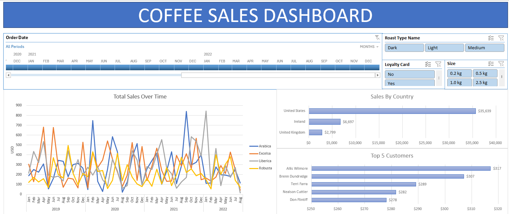

# ☕ Coffee Sales Dashboard in Excel

## Overview

This project showcases an interactive Coffee Sales Dashboard built in Microsoft Excel. The goal was to transform raw sales data into actionable business insights through data cleaning, analysis, and visualization.

The dashboard enables users to explore sales performance across different time periods, countries, customers, and product categories using dynamic filters and interactive visualizations.

## Objectives

* Clean and prepare raw sales data for analysis.
* Combine customer and product information into a centralized dataset.
* Analyze sales trends and customer performance.
* Create an interactive dashboard for business decision-making.

## Tools & Features Used

* Microsoft Excel
* XLOOKUP
* INDEX-MATCH
* IF Functions
* Excel Tables
* Pivot Tables
* Pivot Charts
* Slicers
* Timeline Filters
* Dashboard Design & Formatting

## Project Workflow

### 1. Data Preparation

* Merged customer and product data into the orders dataset using XLOOKUP and INDEX-MATCH.
* Applied IF functions for data categorization and labeling.
* Formatted date fields and removed duplicate records to improve data quality.

### 2. Data Transformation

* Converted the dataset into an Excel Table to support dynamic updates and automatic Pivot Table refreshes.

### 3. Data Analysis

Created Pivot Tables to analyze:

* Total Sales Over Time
* Sales by Country
* Top Customers
* Product Performance

### 4. Dashboard Development

Built an interactive dashboard featuring:

* Sales Trend Analysis
* Country-Level Sales Performance
* Top Customer Insights
* Dynamic filtering using Slicers and Timeline controls

### 5. User Experience Enhancements

* Connected filters across all dashboard visuals.
* Applied consistent formatting and color themes.
* Designed a clean, professional dashboard layout.

## Key Insights

* Identified top-performing customers and regions.
* Tracked sales trends over time.
* Enabled quick filtering by product attributes and customer characteristics.
* Improved accessibility of sales data through interactive visualizations.

## Dashboard Preview

## Files Included

•	Coffee Sales Dashboard.xlsx – Excel workbook containing data preparation, analysis, and dashboard.
•	README.md – Project documentation.
•	Data – Folder containing the data for the project
•	Screenshots – Folder containing screenshot of the dashboard
•	Recordings – Folder containing a record of the dashboard

## Skills Demonstrated

* Data Cleaning
* Data Transformation
* Data Analysis
* Business Intelligence
* Dashboard Design
* Data Visualization
* Excel Reporting
* Analytical Thinking
